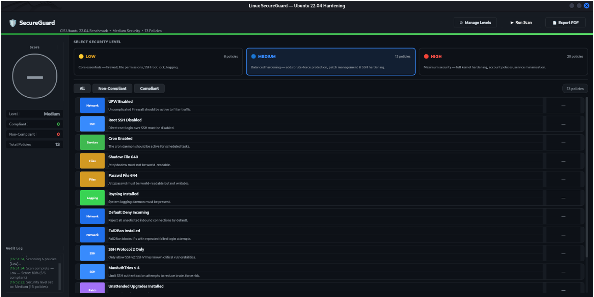
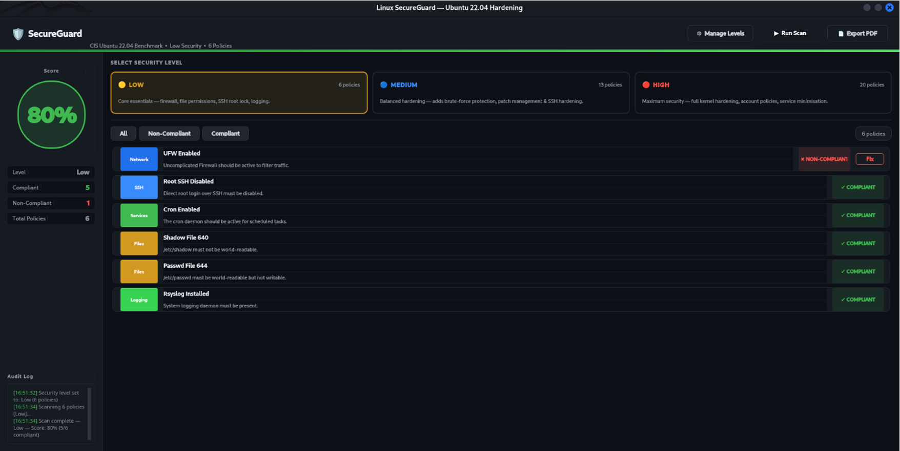
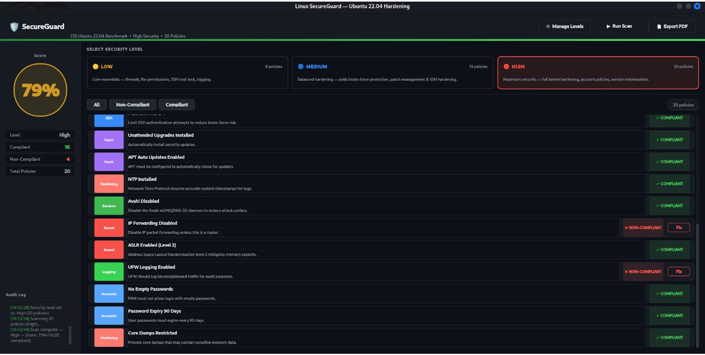
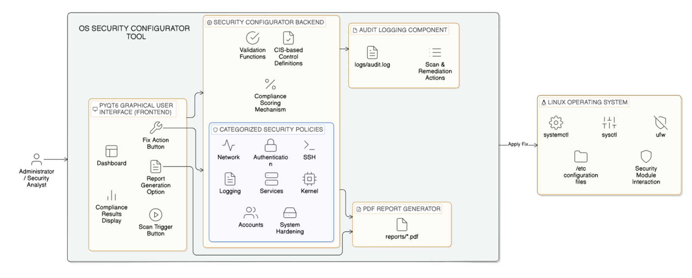
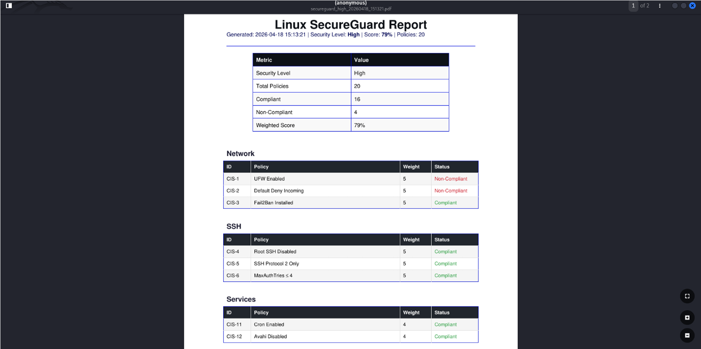

# SecureGuard — Linux Security Scanning & Hardening Tool

SecureGuard is a Python/PyQt6 desktop application for assessing and hardening Linux systems using CIS-inspired security controls, automated remediation, weighted security scoring, audit logging, and compliance-oriented PDF reporting.

The project is designed to help users identify security weaknesses in a Linux system, understand the affected security policies, and apply automated remediation where supported.

---

## Screenshots

### Security Dashboard



### Security Scan



### Policy Management



### Architecture



### Generated Security Report



---

## Key Features

- Linux security posture assessment
- Policy-driven security checks
- CIS-inspired security controls
- Low, Medium, and High security levels
- Automated remediation for supported policies
- Weighted security scoring
- Policy-level compliance status
- Background scanning using PyQt6 worker threads
- Background remediation using PyQt6 worker threads
- Security audit logging
- PDF security and compliance reports
- Policy management interface
- Severity and security-level classification
- System information collection
- Interactive security dashboard

---

## How SecureGuard Works

SecureGuard follows a policy-driven security assessment and remediation workflow:

```text
                 Linux System
                      │
                      ▼
              SecureGuard GUI
                      │
                      ▼
              Security Level
          Low / Medium / High
                      │
                      ▼
               Policy Engine
                      │
              ┌───────┴───────┐
              ▼               ▼
        Security Check     Remediation
              │               │
              ▼               ▼
        Compliance        System Fix
           Result
              │
              ▼
        Weighted Score
              │
       ┌──────┴──────┐
       ▼             ▼
   Audit Log      PDF Report
```

Each security policy contains a check function that evaluates the current system state and, where supported, a remediation function that can attempt to correct a non-compliant configuration.

---

## Security Levels

SecureGuard organizes policies into three security levels.

| Security Level | Policies | Purpose |
|---|---:|---|
| Low | 6 | Baseline security controls |
| Medium | 13 | Enhanced system hardening |
| High | 20 | Comprehensive hardening |

Higher levels progressively apply additional security controls.

---

## Security Controls

The implemented controls cover multiple areas of Linux security, including:

### Network Security
- UFW firewall status
- Default-deny incoming traffic
- IP forwarding configuration
- Firewall logging

### SSH Hardening
- Root SSH login restrictions
- SSH protocol configuration
- Maximum authentication attempts

### Authentication
- Password minimum length
- Password retry limits
- Password expiration
- Empty-password detection

### Patch Management
- Unattended upgrades
- Automatic update configuration

### Services
- Unnecessary service detection/configuration
- Avahi service configuration
- Cron configuration

### File Permissions
- `/etc/shadow` permissions
- `/etc/passwd` permissions

### Kernel Hardening
- IP forwarding
- ASLR configuration
- Core dump restrictions
- USB storage restrictions

### Logging & Monitoring
- Rsyslog availability
- UFW logging
- Audit activity logging

---

## Security Scoring

SecureGuard calculates a weighted security score from the results of the enabled policies.

The scoring process considers:

- Policy compliance
- Policy severity/weight
- Number of evaluated controls
- Overall security-level configuration

The resulting score is displayed through the application dashboard and included in generated security reports.

---

## Background Processing

Security scanning and remediation are performed using PyQt6 background worker threads.

This prevents long-running system checks and remediation commands from blocking the graphical interface.

### Scan Worker

The scan worker:

1. Loads the selected security policies.
2. Executes each policy check.
3. Records the compliance result.
4. Calculates the weighted security score.
5. Reports progress to the GUI.

### Fix Worker

The remediation worker:

1. Receives selected policies.
2. Executes the corresponding remediation functions.
3. Records the remediation result.
4. Updates the interface with the outcome.

---

## Audit Logging

SecureGuard records security activity through an audit log.

The audit trail can contain information about:

- Security scans
- Policy results
- Remediation attempts
- System actions
- Timestamps
- Operational events

Generated runtime logs are intentionally excluded from version control.

---

## PDF Reporting

SecureGuard can generate a PDF security report containing:

- Selected security level
- Total policies evaluated
- Compliant policies
- Non-compliant policies
- Weighted security score
- Policy-level results
- Security categories
- Audit/report metadata

This provides a portable summary of the system's security assessment.

---

## Technology Stack

- **Python**
- **PyQt6**
- **Linux / Ubuntu**
- **ReportLab**
- **Bash / Linux system utilities**
- **JSON**

---

## Project Structure

```text
linux-security-hardening-tool/
│
├── secureguard.py
├── README.md
├── requirements.txt
├── LICENSE
├── .gitignore
│
└── screenshots/
    ├── architecture.png
    ├── report.png
    ├── ui1.png
    ├── ui2.png
    └── ui3.png
```

Runtime directories such as `logs/` and `reports/` are generated by the application when required and are excluded from version control.

---

## Installation

### Requirements

- Linux system
- Python 3.10+
- `sudo` privileges for remediation operations

### Clone the Repository

```bash
git clone https://github.com/KD33-droid/linux-security-hardening-tool.git
cd linux-security-hardening-tool
```

### Create a Virtual Environment

```bash
python3 -m venv .venv
source .venv/bin/activate
```

### Install Dependencies

```bash
pip install -r requirements.txt
```

### Run SecureGuard

```bash
python3 secureguard.py
```

---

## Usage

1. Launch SecureGuard.
2. Select the desired security level.
3. Start a security scan.
4. Review the policy-level results.
5. Examine the overall security score.
6. Select appropriate non-compliant policies for remediation.
7. Review the updated results.
8. Generate a PDF security report if required.
9. Review the audit log for recorded activity.

---

## Security Warning

> **Use SecureGuard only on systems that you own or are authorized to administer.**

SecureGuard performs system-level security checks and remediation operations.

Some remediation functions can modify:

- SSH configuration
- Firewall configuration
- Package configuration
- File permissions
- Authentication configuration
- Kernel parameters
- System services

Some operations require elevated privileges through `sudo`.

### Recommended Testing Environment

Before applying automated remediation to an important or production system:

1. Test SecureGuard inside a virtual machine.
2. Create a snapshot or backup.
3. Review the proposed security changes.
4. Apply remediation selectively.
5. Verify system functionality after changes.

Automated hardening can have unintended effects depending on the system configuration.

---

## Design Approach

SecureGuard uses a policy-oriented architecture in which each security control is represented as a policy with:

- Policy identifier
- Name
- Description
- Severity
- Security level
- Check function
- Remediation function

This allows security checks and remediation logic to remain modular and makes it easier to extend the application with additional controls.

---

## Project Status

### Implemented

- PyQt6 graphical interface
- Security policy engine
- Low / Medium / High security levels
- Linux security checks
- Automated remediation
- Weighted security scoring
- Background scan worker
- Background remediation worker
- Audit logging
- PDF report generation
- Policy management
- Security dashboard

### Future Improvements

Potential future improvements include:

- Expanded CIS Benchmark coverage
- Additional Linux distributions
- More granular risk scoring
- Historical scan comparison
- Expanded compliance mappings
- Additional automated remediation controls
- Enhanced reporting and visualization
- Modular policy configuration
- Additional security testing and validation

---

## Disclaimer

SecureGuard is an academic and security-engineering project intended for authorized security assessment and system hardening.

Always review security changes before applying them to production systems.

---

## License

This project is released under the MIT License.

See [LICENSE](LICENSE) for details.
